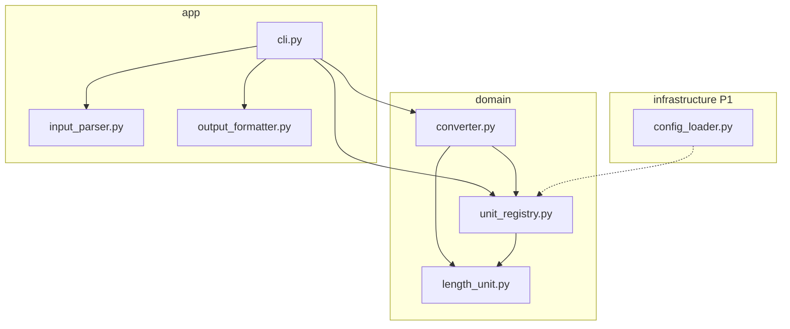

# UnitConverter_22 — OCP/SRP 아키텍처 설계
_Exported on 6/11/2026 from Cursor_

_Source: branch `spec` · D2 단계 1_

---

**User**

@docs/PRD.md @UnitConverter.py
OCP/SRP를 만족하는 Python 패키지 구조를 제안하고, PRD의 FR/NFR을 매핑해줘.

목표 구조 (D2 슬라이드 5):
unit_converter/
  domain/       length_unit.py, unit_registry.py, converter.py
  infrastructure/ config_loader.py  (P1, 이번 핵심 범위 밖)
  app/          input_parser.py, output_formatter.py, cli.py
tests/
  test_converter.py   # Track B (Domain)
  test_cli.py         # Track A (Boundary)

각 모듈의 단일 책임, FR/NFR → 파일 매핑표, To-Do 목록(1 To-Do : 1 Test Case)을 작성해.
코드 생성은 하지 마.

---

**Cursor**

# OCP/SRP 패키지 구조 제안 (D2 슬라이드 5 기준)

## 1. 목표 디렉터리 구조

```
UnitConverter_22/
├── UnitConverter.py              # 하위 호환 엔트리포인트 (cli 위임)
├── unit_converter/
│   ├── __init__.py
│   ├── domain/
│   │   ├── __init__.py
│   │   ├── length_unit.py        # 단위 추상화 (Protocol / 구현체)
│   │   ├── unit_registry.py      # 등록·조회 (OCP 확장점)
│   │   └── converter.py          # meter 허브 기반 순수 변환
│   ├── infrastructure/           # P1 — 이번 P0 핵심 범위 밖
│   │   ├── __init__.py
│   │   └── config_loader.py      # JSON/YAML 비율 로드
│   └── app/
│       ├── __init__.py
│       ├── input_parser.py       # "unit:value" 파싱·검증
│       ├── output_formatter.py   # 결과 문자열 포맷 (P0: README 1줄 형식)
│       └── cli.py                # I/O 오케스트레이션·exit code
└── tests/
    ├── test_converter.py         # Track B — Domain
    └── test_cli.py               # Track A — Boundary
```

**의존 방향 (안쪽으로만):**



- `domain`은 `app`·`infrastructure`에 의존하지 않음 → Domain TC가 I/O 없이 독립 실행 가능 (NFR-03).
- `infrastructure`는 P1에서 `registry`에 단위를 주입하는 어댑터 역할만 담당.

---

## 2. 모듈별 단일 책임 (SRP)

| 모듈 | 단일 책임 | 하지 않는 일 |
|------|-----------|--------------|
| **`length_unit.py`** | 길이 단위의 **계약** 정의 (`name`, `to_meter(value)` 등) 및 P0 기본 구현체(meter/feet/yard) | 입력 파싱, 전체 단위 일괄 출력, stderr/exit code |
| **`unit_registry.py`** | 이름으로 단위 **등록·조회·목록** 제공 — 새 단위는 `register()`로만 확장 (OCP) | 변환 수식, CLI, 출력 포맷 |
| **`converter.py`** | 주어진 `(source_unit, value)`를 **meter 중간값**으로 정규화한 뒤, registry에 있는 **모든 단위**로 변환한 **숫자 결과** 반환 | 문자열 포맷, 입력 검증, `input()`/`print()` |
| **`input_parser.py`** | `단위:값` 문자열 → `(unit, value)` 파싱 + **형식·음수·추가 `:`** 검증 (FR-01, FR-04, FR-05) | 단위 존재 여부(미등록은 registry), 변환 연산 |
| **`output_formatter.py`** | 변환 결과 `(input_value, source_unit, targets…)` → README 계약 문자열 (`2.5 meter = 8.2021 feet` 등) | 변환 로직, 오류 판정 (P1: json/csv/table 분기) |
| **`cli.py`** | argv/stdin 수집 → parser → registry 조회 → converter → formatter → stdout/stderr·**exit code** 조립 | 개별 단위 `to_meter` 구현, if/elif 단위 분기 |
| **`config_loader.py`** *(P1)* | `units.json` 등에서 비율 로드 → registry 초기화용 데이터 제공 (EXT-01) | 런타임 CLI 오케스트레이션 |
| **`UnitConverter.py`** | 레거시 실행 경로 유지 (`python UnitConverter.py`) | 비즈니스 로직 없음 — `cli.main()` 위임만 |

### OCP가 성립하는 지점

| 변경 | 수정 대상 | 수정하지 않는 대상 |
|------|-----------|-------------------|
| `inch` 단위 추가 (NFR-01) | `length_unit.py`에 구현체 추가 + bootstrap에서 `registry.register()` | `converter.py` 핵심, `cli.py` if/elif |
| P1 동적 등록 (EXT-02) | `registry.register()` 호출부 | `converter.convert_all()` 내부 |
| P1 출력 포맷 (EXT-03) | `output_formatter.py` 전략 추가 | `converter.py` |

레거시 baseline의 문제(§3 PRD): `main()` 한 함수에 파싱·분기·상수·출력이 혼재 → 위 4+2 모듈로 **책임 경계**를 나눔.

---

## 3. FR/NFR → 파일 매핑표

### Functional Requirements (P0)

| ID | 요구 | 주 책임 모듈 | 보조 모듈 | 검증 TC (Track) |
|----|------|-------------|-----------|-----------------|
| **FR-01** | `meter:2.5` → `unit=meter`, `value=2.5` | `input_parser.py` | `cli.py` (위임) | U-OUT-01 *(파싱 성공 전제)* |
| **FR-02** | 지원 단위 **전부** 변환·README 형식 출력 | `converter.py` | `output_formatter.py`, `cli.py`, `unit_registry.py` | D-CNV-02, D-CNV-03, **U-OUT-01** |
| **FR-03** | 미등록 단위 `cubit:1` 거부 | `unit_registry.py` | `cli.py` (조회 실패 → stderr, exit≠0) | **U-ERR-01** |
| **FR-04** | 음수 `meter:-1` 거부 | `input_parser.py` | `cli.py` | **U-IN-03** |
| **FR-05** | `meter` / `abc` / `meter:2.5:extra` 형식 거부·크래시 없음 | `input_parser.py` | `cli.py` | **U-IN-01**, **U-IN-02**, **U-IN-04**, **U-IN-05** |

### Non-Functional Requirements (P0)

| ID | 요구 | 구조적 근거 | 검증 TC / 방법 |
|----|------|------------|----------------|
| **NFR-01** | OCP — 단위 추가 시 변환기 핵심 비수정 | `length_unit.py` + `unit_registry.register()` 확장점; `converter.py`는 registry 순회만 | **D-REG-01** *(P1 시나리오이나 OCP 증명용 RED)* |
| **NFR-02** | SRP — Parser / Registry / Converter / Formatter 분리 | `app/` vs `domain/` 레이어 분리 (§2 표) | 구조 리뷰 + 모듈 import 방향 검사 |
| **NFR-03** | 테스트 가능 — 변환·입력 검증 TC | Domain은 I/O 무관; Boundary는 `cli` subprocess/capsys | `test_converter.py` + `test_cli.py` 전체 |

### P1 (Out of Scope — 구조만 예약)

| ID | 요구 | 파일 | TC |
|----|------|------|-----|
| **EXT-01** | 설정 외부화 | `infrastructure/config_loader.py` | **D-CFG-01** |
| **EXT-02** | 동적 단위 등록 | `unit_registry.py` + `cli.py` | **D-REG-01** |
| **EXT-03** | `--format json\|csv\|table` | `output_formatter.py` + `cli.py` | *(P1 TC 별도)* |

### As-Is 실패 사례 → 모듈·TC 대응

| PRD As-Is | 원인 (레거시) | To-Be 담당 | TC |
|-----------|--------------|-----------|-----|
| A-1 `meter:2.5` → feet 1줄만 | if/elif 분기·비대칭 출력 | `converter` + `formatter` | U-OUT-01 |
| A-2 `feet:10` → meter 1줄만 | 동일 | 동일 | D-CNV-03 |
| A-3 `meter:2.5:extra` → ValueError | `split(':',1)` 경계 미처리 | `input_parser` | U-IN-04 |

---

## 4. 데이터 흐름 (P0 Happy Path)

```
argv/stdin "meter:2.5"
    → input_parser.parse()     → ("meter", 2.5)     [FR-01]
    → unit_registry.get("meter")                     [FR-03 경계]
    → converter.convert_all(...)  → {feet: 8.2021, yard: 2.734, ...}  [FR-02]
    → output_formatter.format(...) → stdout 3줄+     [FR-02]
```

오류 경로: parser 실패(FR-04/05) 또는 registry 미등록(FR-03) → `cli`가 메시지·exit code 통일.

---

## 5. To-Do 목록 (1 To-Do : 1 Test Case)

D2 슬라이드 8 Dual-Track RED 기준. **P0 필수** / **P1·확장** 구분.

### Track B — `tests/test_converter.py` (Domain)

| # | To-Do | Test ID | Given | Then (Expected) | FR/NFR |
|---|-------|---------|-------|-----------------|--------|
| B-1 | RED: `to_meter` — 1 feet → meter 환산 | **D-CNV-01** | 1 feet | ≈ 0.3048 m (허용 오차) | FR-02 |
| B-2 | RED: `convert_all` — 2.5 m → feet 5자리 | **D-CNV-02** | 2.5 meter | feet ≈ 8.20210 | FR-02 |
| B-3 | RED: `convert_all` — feet↔yard meter 경유 일치 | **D-CNV-03** | feet 입력 | yard·meter 상호 일관 | FR-02 |
| B-4 | RED: `register(cubit)` 후 변환 가능 *(OCP 증명)* | **D-REG-01** | cubit 0.4572 m 등록 | 변환 성공 | NFR-01 · EXT-02 **(P1)** |
| B-5 | RED: 잘못된 JSON 로드 시 ConfigError | **D-CFG-01** | 깨진 units.json | ConfigError | EXT-01 **(P1)** |

### Track A — `tests/test_cli.py` (Boundary)

| # | To-Do | Test ID | Given | Then (Expected) | FR/NFR |
|---|-------|---------|-------|-----------------|--------|
| A-1 | RED: 빈 입력 형식 오류 | **U-IN-01** | `""` | 형식 오류 메시지·비zero exit | FR-05 |
| A-2 | RED: 콜론 없음 형식 오류 | **U-IN-02** | `meter` | 형식 오류 | FR-05 |
| A-3 | RED: 음수 거부 | **U-IN-03** | `meter:-1` | 거부·오류 메시지 | FR-04 |
| A-4 | RED: 추가 `:` 경계 (`split(': ',1)` 함정) | **U-IN-04** | `meter:2.5:extra` | 형식 오류·**크래시 없음** | FR-05 · As-Is A-3 |
| A-5 | RED: 비숫자 값 형식 오류 | **U-IN-05** | `abc` | 형식 오류 | FR-05 |
| A-6 | RED: 미등록 단위 거부 | **U-ERR-01** | `cubit:1` | 명확한 오류·비zero exit | FR-03 |
| A-7 | RED: Golden Master — 3줄 이상 출력 | **U-OUT-01** | `meter:2.5` | `2.5 meter = … feet`, `… yard` 등 README 형식 | FR-01 · FR-02 |

### 구현 순서 권장 (ARRR · 슬라이드 7)

1. **RED** — 위 12 TC만 작성 (`pytest.fail("RED: …")` 허용, 구현 금지).
2. **GREEN** — B-1~B-3 + A-7 최소 통과 (`length_unit` + `registry` + `converter` + `cli` 스텁 formatter).
3. **REFACTOR** — `input_parser`·`output_formatter` 추출, A-1~A-6·B-1~B-3 GREEN 유지.
4. **P1** — B-4, B-5 + EXT TC (별 브랜치 `new_features`).

---

## 6. `UnitConverter.py`와의 관계

현재 워킹트리는 이미 엔트리포인트 분리를 반영합니다.

```python
"""Backward-compatible entry point."""

from unit_converter.app.cli import main

if __name__ == "__main__":
    raise SystemExit(main())
```

- **SRP**: 루트 스크립트 = 실행 진입점만.
- **NFR-03**: Domain TC는 `UnitConverter.py`를 거치지 않고 `domain`·`converter`를 직접 import.

---

## 7. C2C 추적 요약

| PRD | Primary File(s) | Test ID |
|-----|-------------------|---------|
| FR-01 | `input_parser.py` | U-OUT-01 |
| FR-02 | `converter.py`, `output_formatter.py` | D-CNV-02, D-CNV-03, U-OUT-01 |
| FR-03 | `unit_registry.py`, `cli.py` | U-ERR-01 |
| FR-04 | `input_parser.py` | U-IN-03 |
| FR-05 | `input_parser.py` | U-IN-01, 02, 04, 05 |
| NFR-01 | `length_unit.py`, `unit_registry.py` | D-REG-01 |
| NFR-02 | 전체 패키지 레이아웃 | 구조 리뷰 |
| NFR-03 | `tests/*` | 12 TC |

P0 **필수 RED**는 **B-1~B-3 + A-1~A-7 (10건)**; **B-4, B-5**는 P1·NFR-01 선행 증명용으로 RED만 걸어 두고 GREEN은 `new_features`에서 처리하면 PRD §5와 일치합니다.

---

**User**

/export-report-transcript

---

**Cursor**

**Ask 모드**에서는 `Report/`·`Prompting/` 파일을 생성·수정할 수 없어 Export가 실행되지 않았습니다.

**Agent 모드**로 전환한 뒤 `/export-report-transcript`를 다시 실행하면 아래 내용이 `02`번으로 기록됩니다.

---

## Export 예정 정보

| 항목 | 값 |
|------|-----|
| **NN** | `02` (기존 `01` + 1, 덮어쓰기 없음) |
| **Phase** | Design (D2 단계 1) |
| **주제** | OCP/SRP 아키텍처 설계 |
| **pytest** | 미실행 |
| **Git 브랜치** | `spec` (01.REPORT 기준, 본 세션 변경 없음) |
| **산출물** | `Report/02.REPORT.md` + `Prompting/02.Export-Transcript.md` |

---

## `Report/02.REPORT.md` (작성 예정 본문)

*(Ask 모드에서 Report 초안 전문 제시 — Agent 모드 재실행 시 파일로 저장)*

---

## 다음 액션

1. 채팅 모드를 **Agent**로 전환
2. `/export-report-transcript` 재실행

Agent 모드에서는 `Report/02.REPORT.md`와 `Prompting/02.Export-Transcript.md`가 자동 생성됩니다.

---

**User**

/export-report-transcript

---

**Cursor**

Export 완료. `Report/02.REPORT.md`와 `Prompting/02.Export-Transcript.md`를 생성했습니다.

---
